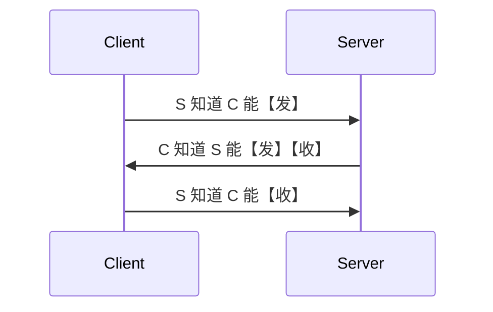
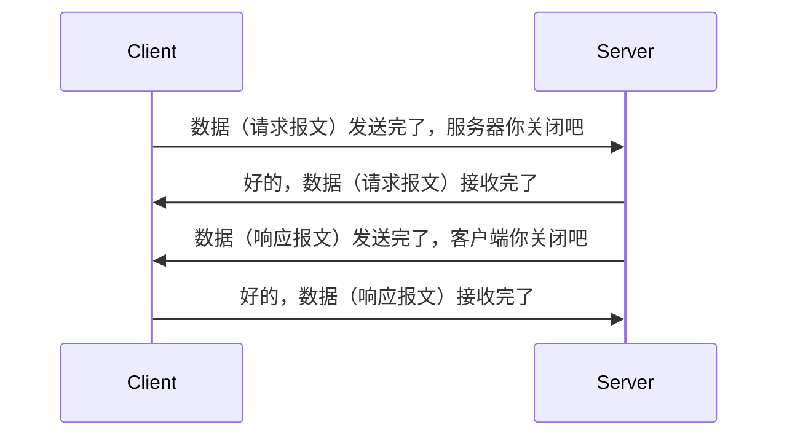

## 0. DNS 解析（域名 -> IP）

```js
浏览器缓存 -> hosts文件或系统缓存 -> 外部缓存（例如路由器） -> 对应的域名服务器查找并解析（images.baidu.com）
```

C:\Windows\System32\drivers\etc

## 1. 建立 TCP 连接，三次握手

目的：是为了让对方知道自己具备【收】【发】信息的能力，仅自己知道是没有意义的！



## 2. 发送请求（请求报文）

## 3. 响应数据（响应报文）

## 4. 渲染页面


(1) 遇见 HTML 标记，调用 HTML 解析器，处理 HTML 标记并构建 DOM 树
(2) 遇见 style/link 标记，调用 CSS 解析器，处理 CSS 标记并构建 CSSOM 树
(3) 将 DOM 与 CSSOM 合并成一个渲染树
(4) 根据渲染树来布局，以计算每个节点的几何信息（reflow，回流/重排）
(5) 将各个节点绘制到屏幕上（repaint，重绘）

`DOM 树和 CSSOM 构建是 CPU 完成的，最后生成合成树是 GPU 来渲染的`

如果 DOM 或 CSSOM 被修改，您只能再执行一遍以上所有步骤，以确定哪些像素需要在屏幕上进行重新渲染！

[参考资料](https://developers.google.com/web/fundamentals/performance/critical-rendering-path/render-tree-construction)


## 5. 断开 TCP 连接，四次挥手
4 次挥手的目的是为了确保双方都没有数据传输时才进行断开连接！

