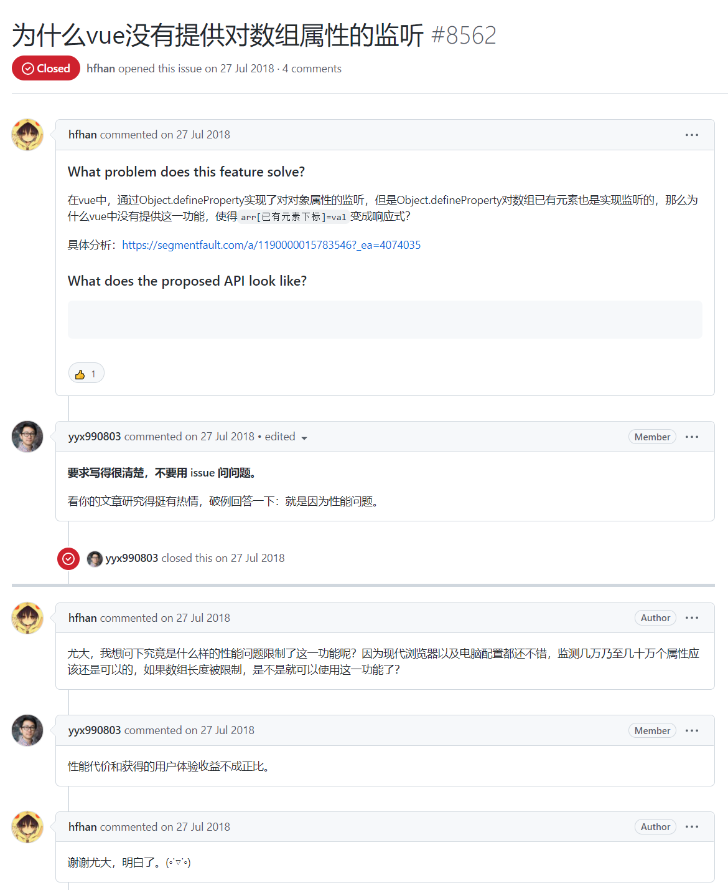

## 一、传统做法


### 1.1 数据劫持一个属性

```html
<p id="oP"></p>
<input type="text" id="oInput">
<script>
    const obj = {
        name: ''
    };

    const objCopy = { ...obj };

    Object.defineProperty(obj, 'name', {
        get() {
            return objCopy.name
        },
        set(newValue) {
            oP.innerHTML = newValue;
            oInput.value = newValue;
            objCopy.name = newValue;
        }
    });

    oInput.oninput = function (e) {
        obj.name = e.target.value;
    };
</script>
```

### 1.2 多个属性时怎么办

<font color=red>通过打印 obj 发现 info 并没有被劫持</font>

```js
const obj = {
    name: '',
    info: ''
};

// ...
// 发现 info 并不是响应式的
oInput.oninput = function (e) {
    obj.info = e.target.value;
};
```

### 1.3 数据劫持多个属性

```js
const obj = {
    name: '',
    info: ''
};

const objCopy = { ...obj };

Object.keys(obj).forEach(key => {
    Object.defineProperty(obj, key, {
        get() {
            return objCopy[key]
        },
        set(newValue) {
            oP.innerHTML = newValue;
            oInput.value = newValue;
            objCopy[key] = newValue;
        }
    });
});

oInput.oninput = function (e) {
    obj.name = e.target.value;
};
```

### 1.4 提取 defineReactive 函数

把 `Object.defineProperty`  的代码封装到 defineReactive 函数里面

```js
const obj = {
    name: '',
    info: ''
};

const objCopy = { ...obj };

Object.keys(obj).forEach(key => {
    defineReactive(obj, key, objCopy[key]);
});

function defineReactive(obj, key, value) {
    Object.defineProperty(obj, key, {
        get() {
            return value
        },
        set(newValue) {
            oP.innerHTML = newValue;
            oInput.value = newValue;
            value = newValue;
        }
    });
}

oInput.oninput = function (e) {
    obj.info = e.target.value;
};
```

删除 `objCopy` 对象

```js
Object.keys(obj).forEach(key => {
    defineReactive(obj, key, obj[key]);
});
```

### 1.5 嵌套对象时怎么班

```js
const obj = {
    name: '',
    info: '',
    data: {
        str: ''
    }
};

// ...

// 问题：又不是响应式的了
oInput.oninput = function (e) {
    obj.data.str = e.target.value;
};
```

### 1.6 递归劫持

```js
const obj = {
    name: '',
    info: '',
    data: {
        str: ''
    }
};

// #1
function walk(obj) {
    // #4
    if (!obj || typeof obj !== 'object') return;
    Object.keys(obj).forEach(key => {
        defineReactive(obj, key, obj[key]);
    });
}

// #2
walk(obj);

function defineReactive(obj, key, value) {
    // #3
    walk(value);
    Object.defineProperty(obj, key, {
        get() {
            return value
        },
        set(newValue) {
            oP.innerHTML = newValue;
            oInput.value = newValue;
            value = newValue;
        }
    });
}

oInput.oninput = function (e) {
    obj.data.str = e.target.value;
};
```

## 二、存在问题

1\. 只能对已存在的属性进行劫持，后续添加的属性没有感知（不具有响应式），删除属性没有感知

```js
oInput.oninput = function (e) {
    obj.xxx = e.target.value;
};
```

```js
function defineReactive(obj, key, value) {
    walk(value);
    Object.defineProperty(obj, key, {
        get() {
            return value
        },
        set(newValue) {
            oP.innerHTML = newValue;
            oInput.value = newValue;
            value = newValue;
        },
        // #4
        configurable: true
    });
}
// #1
obj.name = 'xxx';
// #2
delete obj.name;
// #3
console.log(obj.name)
```

为此，Vue 不得不提供了其他方案去解决

```js
Vue.set() 或 this.$set
Vue.delete() 或 this.$delete
```

2\. Vue 没有提供对数组的监听（并不是 `Object.defineProperty` 不支持对数组的劫持），[#8562](https://hub.fastgit.org/vuejs/vue/issues/8562)

注意：我们上面写的响应式代码是支持对数组监听的（前提 value 已存在）

```js
const obj = {
    name: '',
    info: '',
    data: {
        str: ''
    },
    arr: ['hello']
};
// ...
oInput.oninput = function (e) {
    obj.arr[0] = e.target.value;
};
```



3\. 对象里面还有复杂数据类型的话，需要递归劫持里面的**每一个属性**（性能问题）

<font color=red>核心一句话：Vue3 处理响应式的 API 换成 Proxy 是出于性能考虑！</font>

## 三、解决方案

[Proxy 是什么](https://developer.mozilla.org/zh-CN/docs/Web/JavaScript/Reference/Global_Objects/Proxy)，Proxy 对象用于创建一个对象的代理，从而实现基本操作的拦截和自定义（如属性查找、赋值、枚举、函数调用等）

### 3.1 一个或多个属性

```html
<p id="oP"></p>
<input type="text" id="oInput">
<script>
    const obj = {
        name: ''
    };
    const proxyObj = new Proxy(obj, {
        get(target, key, receiver) {
            console.log(target === obj);
            console.log(proxyObj === receiver);
            return target[key];
        },
        set(target, key, newValue, receiver) {
            oP.innerHTML = newValue;
            oInput.value = newValue;
            target[key] = newValue;
        }
    });

    oInput.oninput = function (e) {
        proxyObj.name = e.target.value;
    };
</script>
```

### 3.2 对不存在的 key 进行操作

你会发现也是响应式的，因为 Proxy 代理的直接是一个对象，而不是对象里面一个一个的属性

```js
const obj = {
    name: ''
};
// ...

oInput.oninput = function (e) {
    proxyObj.xxx = e.target.value;
};
```

### 3.3 嵌套对象时怎么办

知识铺垫

```js
const obj = {
    name: '',
    data: {
        str: ''
    }
};
const proxyObj = new Proxy(obj, {
    get(target, key, receiver) {
        console.log('get')
        return target[key];
    },
    set(target, key, newValue, receiver) {
        console.log('set')
        oP.innerHTML = newValue;
        oInput.value = newValue;
        target[key] = newValue;
    }
});

// proxyObj.name = 2; // 会触发一次 set，但不会触发 get
proxyObj.data.str = 2; // 会触发一次 get，但不会触发 set，其实也应该期望触发 set
```

解决方案

```js
const obj = {
    name: '',
    data: {
        str: ''
    }
};
// #1
const handler = {
    get(target, key, receiver) {
        console.log('get');
        // #2
        if (target[key] !== null && typeof target[key] === 'object') {
            return new Proxy(target[key], handler);
        }
        return target[key];
    },
    set(target, key, newValue, receiver) {
        console.log('set');
        oP.innerHTML = newValue;
        oInput.value = newValue;
        target[key] = newValue;
    }
}
// #0
const proxyObj = new Proxy(obj, handler);

oInput.oninput = function (e) {
    proxyObj.data.str = e.target.value;
};
```

### 3.4 拦截删除功能

```js
const obj = {
    name: '',
    data: {
        str: ''
    }
};
const handler = {
    get(target, key, receiver) {
        console.log('get');
        if (target[key] !== null && typeof target[key] === 'object') {
            return new Proxy(target[key], handler);
        }
        return target[key];
    },
    set(target, key, newValue, receiver) {
        console.log('set');
        oP.innerHTML = newValue;
        oInput.value = newValue;
        target[key] = newValue;
    },
    // #0
    deleteProperty(target, key) {
        oP.innerHTML = '';
        oInput.value = '';
        return delete target[key];
    }
}
const proxyObj = new Proxy(obj, handler);

// #1
proxyObj.name = 'xxx';
// #2
delete proxyObj.name;
// #3
console.log(proxyObj.name)
```

## 四、关于反射

### 4.1 增删改查

```js
const obj = {
    name: 'ifer',
    test: 'xxx'
};

// 增
Reflect.set(obj, 'age', 18);
// 删
Reflect.deleteProperty(obj, 'test');
// 改
Reflect.set(obj, 'name', 'elser');
// 查
console.log(Reflect.get(obj, 'name'));
```

### 4.2 为什么使用 Reflect

```js
const obj = {};
/* Object.defineProperty(obj, 'name', {
    get() {
        return 'ifer'
    }
});

Object.defineProperty(obj, 'name', {
    get() {
        return 'elser'
    }
});

console.log(obj.name); */

// Reflect 可以把错误吃了
// 你可能会想这还不如爆出来呢，报出来我才知道错了，你这不诱导我犯错误吗？
/* Reflect.defineProperty(obj, 'name', {
    get() {
        return 'ifer'
    }
});

Reflect.defineProperty(obj, 'name', {
    get() {
        return 'elser'
    }
});

console.log(obj.name); */

// 但是对于框架封装者来说，可不想由于一行代码的错误导致整个程序崩溃
// 这个时候不得不使用大量的 try catch
// 所以，有的时候我不关心错误时，只想代码顺利的走下去，就可以直接使用 Reflect，减少 try catch 的使用

// 你可能还会疑问，当我就需要关心错误时，那我怎么知道哪里错了，答案是返回值！
const a = Reflect.defineProperty(obj, 'c', {
    get() {
        return 'xxx'
    }
});
const b = Reflect.defineProperty(obj, 'c', {
    get() {
        return 'xxx'
    }
});

console.log(a)
console.log(b)
```

### 4.3 改写响应式代码

```js
const obj = {
    name: '',
    data: {
        str: ''
    }
};
const handler = {
    get(target, key, receiver) {
        if (target[key] !== null && typeof target[key] === 'object') {
            return new Proxy(target[key], handler);
        }
        // #1
        return Reflect.get(...arguments);
    },
    set(target, key, newValue, receiver) {
        oP.innerHTML = newValue;
        oInput.value = newValue;
        // #2
        Reflect.set(...arguments);
    },
    deleteProperty(target, key) {
        oP.innerHTML = '';
        oInput.value = '';
        delete target[key];
    }
}
const proxyObj = new Proxy(obj, handler);

oInput.oninput = function (e) {
    proxyObj.data.str = e.target.value;
};
```

🎈Vue3 响应式原理：通过 Proxy（代理） 拦截整个对象中任意属性的变化，通过 Reflect（反射） 对源对象进行操作！

